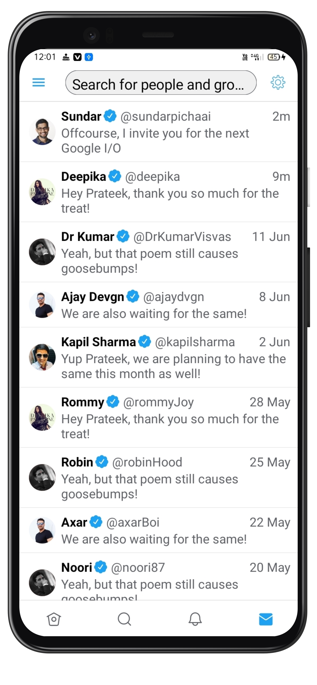

# twitter-compose

## This app's UI is solely made with the latest Jetpack Compose library ❤️

### Disclaimer 🙏
This android application is built to learn the latest Jetpack Compose library. The tweets are used only for showcasing purposes. There is no bad intention for anything included in this app.

### Features 😎

- Light and Dark mode and easy switching between them
- Bottom navigation for all four screens
- Stories palette
- Dynamic Top Bar changes according to every screen
- Navigation Drawer aka Side Drawer
- Tabbed navigation inside search screen

### Doings :technologist:
- Made the whole UI with Jetpack Compose
- State management for recomposition
- Code reusability for UI components
- Created generalized things, like Scaffold, Theme etc, which can be used for every screens
- Used Dagger Hilt
- Gave the taste of MVVM by separating Data, Domain and UI things in different packages


### Screens
HomeScreen(Light)             |  HomeScreen(Dark) | HomeScreen(Light) | HomeScreen(Dark)
:-------------------------:|:-------------------------: | :-------------------------: | :-------------------------: 
  |   |  | 

SearchScreen(Light)             |  SearchScreen(Dark) | MessageScreen(Light) | MessageScreen(Dark)
:-------------------------:|:-------------------------: | :-------------------------: | :-------------------------: 
  |   |  | 

DrawerScreen(Light)             |  DrawerScreen(Dark) | 
:-------------------------:|:-------------------------: | 
  |  

### Status: 🚧 In progress
<p>This twitter clone is still under development and some screens are yet to be designed.</p>

### Libraries used 📚

* [Jetpack Compose]
* [Accompanist]
* [Coroutines]
* [Compose Navigation]

[Jetpack Compose]: https://developer.android.com/jetpack/compose
[Accompanist]: https://github.com/chrisbanes/accompanist
[Coroutines]: https://developer.android.com/kotlin/coroutines
[Compose Navigation]: https://developer.android.com/jetpack/compose/navigation

### P.S. 🙃
Your stars on this library means you appreciate my work 😇


### License
```
Copyright 2020 Prateek Sharma

Licensed under the Apache License, Version 2.0 (the "License");
you may not use this file except in compliance with the License.
You may obtain a copy of the License at

    http://www.apache.org/licenses/LICENSE-2.0

Unless required by applicable law or agreed to in writing, software
distributed under the License is distributed on an "AS IS" BASIS,
WITHOUT WARRANTIES OR CONDITIONS OF ANY KIND, either express or implied.
See the License for the specific language governing permissions and
limitations under the License.
```
